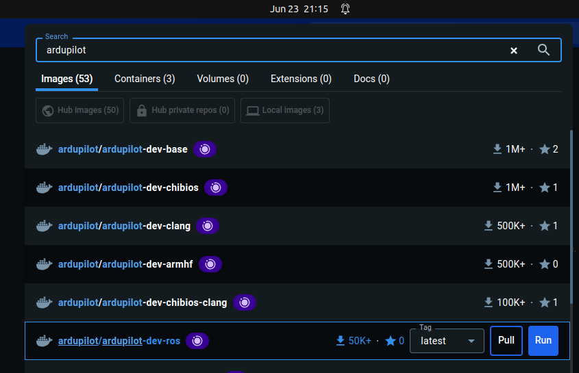
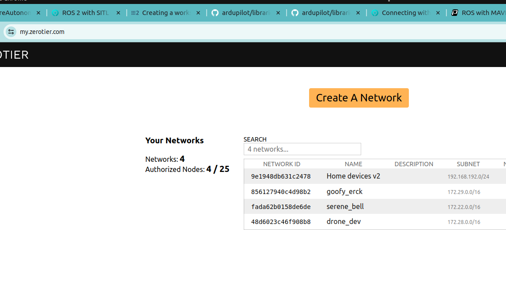
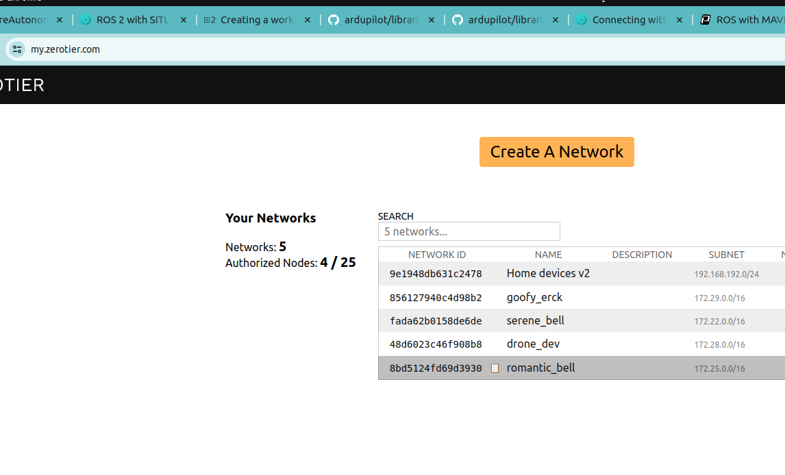
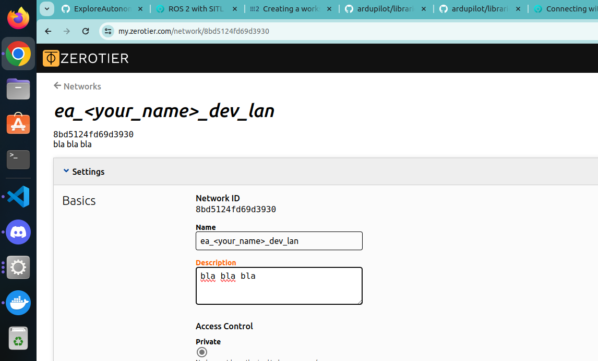
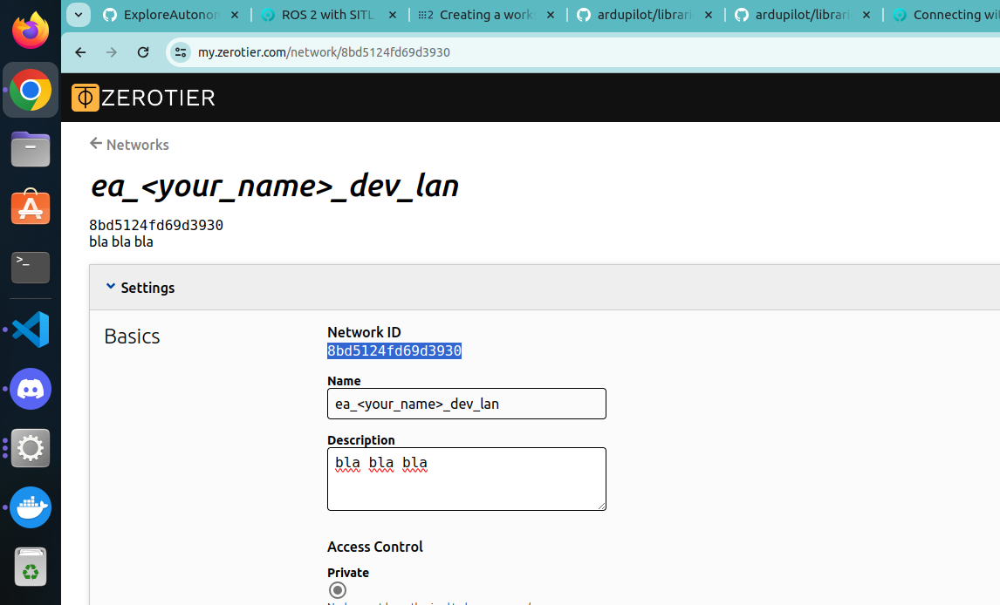
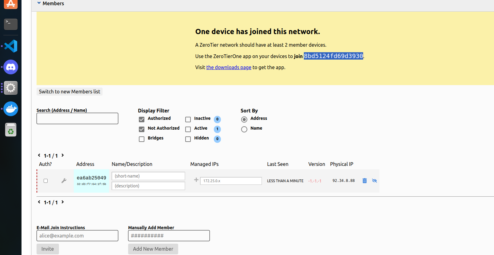
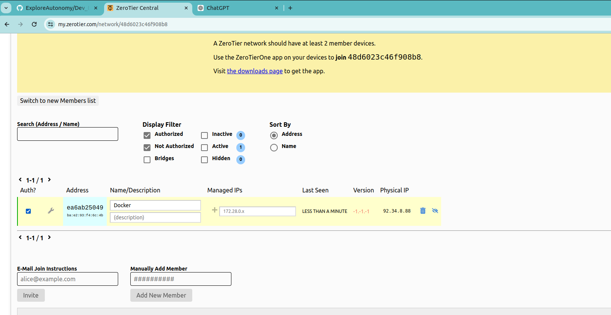

Author: Casper Augustsson Savinov
mail: casper9429@gmail.com
Date: 2024-07-23

- [Dev\_Env](#dev_env)
  - [Requirements](#requirements)
  - [Install Docker](#install-docker)
    - [Install Docker Engine on Ubuntu 22.04 LTS](#install-docker-engine-on-ubuntu-2204-lts)
    - [Install Docker Desktop on Ubuntu 22.04 LTS](#install-docker-desktop-on-ubuntu-2204-lts)
    - [Sign in to Docker Desktop](#sign-in-to-docker-desktop)
  - [Lazy Download Container](#lazy-download-container)
  - [Create the docker container and connect to it](#create-the-docker-container-and-connect-to-it)
  - [Start a Docker container](#start-a-docker-container)
  - [Stop a Docker container](#stop-a-docker-container)
  - [Install Ros2 Humble](#install-ros2-humble)
  - [Install/RUN Ardupilot DDS](#installrun-ardupilot-dds)
    - [Create a workspace for the ardupilot DDS](#create-a-workspace-for-the-ardupilot-dds)
    - [Install Eprosima Fast DDS and dependencies](#install-eprosima-fast-dds-and-dependencies)
    - [Setup the ardupilot DDS workspace](#setup-the-ardupilot-dds-workspace)
    - [Run the ardupilot DDS](#run-the-ardupilot-dds)
  - [Install/RUN PX4 DDS](#installrun-px4-dds)
    - [Install PX4](#install-px4)
    - [Setup Micro-XRCE-DDS-Agent for PX4](#setup-micro-xrce-dds-agent-for-px4)
    - [RUN PX4 DDS](#run-px4-dds)
  - [Install/RUN MAVROS](#installrun-mavros)
    - [Install MAVROS](#install-mavros)
    - [RUN MAVROS](#run-mavros)
  - [Setup ZeroTier](#setup-zerotier)
    - [Create a ZeroTier network](#create-a-zerotier-network)
    - [Install ZeroTier in docker container](#install-zerotier-in-docker-container)
    - [Save final container without joining ZeroTier network](#save-final-container-without-joining-zerotier-network)
    - [Join ZeroTier network](#join-zerotier-network)


# Dev_Env
This is a guide to setup a development environment for PX4, Ardupilot, DDS, MAVROS, and ZeroTier in a docker container for drone development. 

The tutorial is tested on Ubuntu 22.04 LTS. But it should work on OS that supports docker. But the steps
on the host machine may vary. Every thing assumes that you are using a fresh installation of Ubuntu 22.04 LTS.

There is nothing limiting the instructions to Docker. Skip the docker part if you want to install the tools on your host machine. A lot of conflict sensitive tools are installed, therefore, if done on the host machine, it is recommended to do it on a fresh installation of Ubuntu 22.04 LTS and be ready to reinstall the OS if things go wrong.


## Requirements
- A KVM enabled machine with Ubuntu 22.04 LTS installed (only if you want to use docker)
- Around 50 GB of free space on your machine 

To check if your machine supports KVM, run the following command:
1. Load the kvm module
```
modprobe kvm
```
Depending on your machine, you may need to load the kvm_intel or kvm_amd module. To load the kvm_intel module, run the following command:
```
modprobe kvm_intel
```
Alternatively, to load the kvm_amd module, run the following command:
```
modprobe kvm_amd
```
2. Check if KVM is enabled
```
kvm-ok
```
If KVM is enabled, you should see the following output:
```
info: /dev/kvm exists
KVM acceleration can be used
```
If KVM is not enabled, you should see the following output:
```
INFO: Your CPU does not support KVM extensions
KVM acceleration can NOT be used
```
This means that your CPU does not support KVM extensions, and you will not be able to use KVM acceleration. This can often be solved by enabling virtualization in your BIOS settings. If you are using a virtual machine, you may need to enable nested virtualization.

Next, you might need to add your user to the kvm group to run docker without sudo. To do this, run the following command:
```
sudo usermod -aG kvm $USER
```
Sign out and sign back in to apply the changes.


## Install Docker 

If you are using Ubuntu 22.04 LTS you can follow the steps below to install docker. Otherwise, you need to find the installation guide for your OS.

For ease of use, you should install both Docker Engine and Docker Desktop. Docker Engine is a container runtime that allows you to run containers on your machine, while Docker Desktop is a desktop application that provides a graphical user interface for managing containers.

### Install Docker Engine on Ubuntu 22.04 LTS
[Source Of Content](https://docs.docker.com/engine/install/ubuntu/#install-using-the-repository)

1. Set up docker apt repository
```
# Add Docker's official GPG key:
sudo apt-get update
sudo apt-get install ca-certificates curl
sudo install -m 0755 -d /etc/apt/keyrings
sudo curl -fsSL https://download.docker.com/linux/ubuntu/gpg -o /etc/apt/keyrings/docker.asc
sudo chmod a+r /etc/apt/keyrings/docker.asc

# Add the repository to Apt sources:
echo \
  "deb [arch=$(dpkg --print-architecture) signed-by=/etc/apt/keyrings/docker.asc] https://download.docker.com/linux/ubuntu \
  $(. /etc/os-release && echo "$VERSION_CODENAME") stable" | \
  sudo tee /etc/apt/sources.list.d/docker.list > /dev/null
sudo apt-get update
```

2. Install Docker
```
 sudo apt-get install docker-ce docker-ce-cli containerd.io docker-buildx-plugin docker-compose-plugin
```


3. Verify that Docker is installed correctly by running the hello-world image.
```
 sudo docker run hello-world
```

### Install Docker Desktop on Ubuntu 22.04 LTS
[Source Of Content](https://docs.docker.com/desktop/install/linux-install/)

1. Download the Docker Desktop .deb package from the Docker Hub.
[docker desktop download link](
https://desktop.docker.com/linux/main/amd64/149282/docker-desktop-4.30.0-amd64.deb?utm_source=docker&utm_medium=webreferral&utm_campaign=docs-driven-download-linux-amd64&_gl=1*b7jdek*_ga*MTYxMTYyMzg2MS4xNzE5MDkxMzIz*_ga_XJWPQMJYHQ*MTcxOTE2NzkwMi4xLjEuMTcxOTE2ODU0OS40OS4wLjA.)
2. Install the .deb package
```
sudo apt-get update

cd ~/Downloads

sudo apt-get install ./docker-desktop-<version>-<arch>.deb
```

### Sign in to Docker Desktop
Docker Desktop for Linux relies on pass to store credentials in gpg2-encrypted files. Before signing in to Docker Desktop with your Docker ID, you must initialize pass. Docker Desktop displays a warning if you've not initialized pass.

[Source Of Content](https://docs.docker.com/desktop/get-started/)

You can initialize pass by using a gpg key. To generate a gpg key, run:
```
gpg --generate-key
```

The following is an example of the output:
```
...
GnuPG needs to construct a user ID to identify your key.

Real name: Molly
Email address: molly@example.com
You selected this USER-ID:
   "Molly <molly@example.com>"

Change (N)ame, (E)mail, or (O)kay/(Q)uit? O
...
pubrsa3072 2022-03-31 [SC] [expires: 2024-03-30]

 <generated gpg-id public key> 

uid          Molly <molly@example.com>
subrsa3072  2022-03-31 [E] [expires: 2024-03-30]
```
Initialize pass by running:
```
pass init <your_generated_gpg-id_public_key>
```

## Lazy Download Container
If you are lazy, you can download the image from docker hub [here](https://hub.docker.com/r/casper9429/ea_dev_env?uuid=15f4cc82-7cf2-49ac-8b51-20fbad5ffe2d%0A) and skip the rest of the steps.

You still need to run it using:
```
docker run -it --cap-add=NET_ADMIN --cap-add=SYS_ADMIN --device=/dev/net/tun --name ardupilot_px4_dds_mavros <IMAGE ID> bash
```
For zerotier to work, you need to join the network manually.


## Create the docker container and connect to it
Go into docker desktop and search for ardupilot. Click on the ardupilot/ardupilot-dev-ros image and click on the run button. This will create a container with the image.


Open a terminal and run the following command to list all the containers:
```
docker images
```
It should look something like this:
```
REPOSITORY                    TAG       IMAGE ID       CREATED        SIZE
ardupilot/ardupilot-dev-ros   latest    <IMAGE ID>     2 weeks ago    2.84GB
.
.
<may be other images>
```

Copy the IMAGE ID of the ardupilot/ardupilot-dev-ros image and run the following command to create a container:
```
docker run -it --cap-add=NET_ADMIN --cap-add=SYS_ADMIN --device=/dev/net/tun --name ardupilot_px4_dds_mavros <IMAGE ID> bash
```
This will create a container with the name ardupilot_px4_dds_mavros. You can change the name to whatever you want. The --cap-add=NET_ADMIN --cap-add=SYS_ADMIN --device=/dev/net/tun flags are used to give the container the necessary permissions to run ZeroTier. The bash command is used to open a bash shell in the container.

Open a additional terminal and run the following command to list all the running containers:
```
docker ps
```
It should look something like this:
```
CONTAINER ID   IMAGE          COMMAND                  CREATED          STATUS          PORTS     NAMES
<CONTAINE ID>   <96b1a49f525e>   "/ros_entrypoint.sh …"   18 seconds ago   Up 18 seconds             ardupilot_px4_dds_mavros
```
Copy the `<CONTAINER ID>` and write in the terminal:
```
docker exec -it <CONTAINER ID> bash
```
This will open the bash shell in the container in this terminal.
You can run the same command in as many terminals as you want to open multiple bash shells in the container.

To exit the container, run the following command:
```
exit
```


## Start a Docker container
To list all the containers, run the following command:
```
docker ps -a
```
It should look something like this:
```
CONTAINER ID   IMAGE          COMMAND                  CREATED          STATUS          PORTS     NAMES
<CONTAINE ID>   <96b1a49f525e>   "/ros_entrypoint.sh …"   18 seconds ago   Up 18 seconds             ardupilot_px4_dds_mavros
```

To start the container, run the following command:
```
docker start <CONTAINER ID>
```

Now to connect to the container, run the following command:
```
docker exec -it <CONTAINER ID> bash
```


## Stop a Docker container
To list all running containers, run the following command:
```
docker ps
```

To stop the container, run the following command:
```
docker stop <CONTAINER ID>
```


## Install Ros2 Humble
Everything in this section is done in the container, see the previous section to open a bash shell in the container.

Ros2 Humble is already installed in the ardupilot/ardupilot-dev-ros image. 

It is recommended to run the following commands to update the ros2 humble installation:
```
sudo apt update
sudo apt upgrade
```

Also install all desktop tools:
```
sudo apt install ros-humble-desktop
```

Next add ros2 humble relevant aliases to the bashrc file:
```
sudo apt install ne 
```
ne is a command line text editor much more user friendly than vim. You can use vim if you want.
```
ne ~/.bashrc
```

Add the following lines to the end of the file:
```
alias sw='source /opt/ros/humble/setup.bash'
alias so='source ./install/setup.bash'
alias rb='source ~/.bashrc'
```

`sw` is used to source the ros2 humble setup.bash file. `so` is used to source the setup.bash file in the current directory. `rb` is used to source the bashrc file, making `source ~/.bashrc` easier to type from the terminal.

Save the file and run the following command to apply the changes:
```
source ~/.bashrc
```


## Install/RUN Ardupilot DDS 


### Create a workspace for the ardupilot DDS
Create a workspace for the ardupilot DDS:
```
cd

mkdir -p ros2_ap_ws/src

cd ros2_ap_ws

sw 
```
If sw does not work, run the following command:
```
source /opt/ros/humble/setup.bash
```

### Install Eprosima Fast DDS and dependencies
This step is to install dependencies. This step is extremely important to do right.

Install Java:
```
sudo apt install default-jre
```


Install Micro-XRCE-DDS-Agent:
```
cd ~/ros2_ap_ws

git clone --recurse-submodules https://github.com/ardupilot/Micro-XRCE-DDS-Gen.git

cd Micro-XRCE-DDS-Gen

./gradlew assemble

```
This might take a while.

Add path to the Micro-XRCE-DDS-Agent to the bashrc file:
```
cd ~/ros2_ap_ws/Micro-XRCE-DDS-Gen

echo "export PATH=\$PATH:$PWD/scripts" >> ~/.bashrc

rb
```


Next install geograpics_msgs and MAVproxy:
```
sudo apt install ros-humble-geographic-msgs
pip install -U MAVProxy
```


### Setup the ardupilot DDS workspace

cd into the ros2_ap_ws
```
cd ~/ros2_ap_ws
```

Run the following command
```
vcs import --recursive --input  https://raw.githubusercontent.com/ArduPilot/ardupilot/master/Tools/ros2/ros2.repos src
```
This might take a while. It is SLOOOOO O O W.


Now update the workspace:
```
cd ~/ros2_ap_ws
sudo apt update
rosdep update
sw
rosdep install --from-paths src --ignore-src
```
It will ask you to install some dependencies. Press y to install them.

Now build the workspace:
```
cd ~/ros2_ap_ws
colcon build
```
This will take a while. 

If this message appears:
```
CMake Warning (dev) at /usr/share/cmake-3.22/Modules/FindPackageHandleStandardArgs.cmake:438 (message):
  The package name passed to `find_package_handle_standard_args` (tinyxml2)
  does not match the name of the calling package (TinyXML2).  This can lead
  to problems in calling code that expects `find_package` result variables
  (e.g., `_FOUND`) to follow a certain pattern.
Call Stack (most recent call first):
  cmake/modules/FindTinyXML2.cmake:40 (find_package_handle_standard_args)
  /opt/ros/humble/share/fastrtps/cmake/fastrtps-config.cmake:51 (find_package)
  CMakeLists.txt:153 (find_package)
This warning is for project developers.  Use -Wno-dev to suppress it.
```
SAIKED! Did you get scared? It is just a warning, do not worry about it.


Next add path to ardupilot SITL to the bashrc file:
```
ne ~/.bashrc
```

Add the following line to the end of the file and save it:
```
export PATH=$PATH:~/ros2_ap_ws/src/ardupilot/Tools/autotest
```

Reload bashrc by tpyping in the terminal:
```
rb
```

You are now ready to run the ardupilot DDS.

### Run the ardupilot DDS

To run the ardupilot DDS, you need to run the following commands in the terminal:

```
cd ~/ros2_ap_ws

sw

so

ros2 launch ardupilot_sitl sitl_dds_udp.launch.py transport:=udp4 synthetic_clock:=True wipe:=False model:=quad speedup:=1 slave:=0 instance:=0 defaults:=$(ros2 pkg prefix ardupilot_sitl)/share/ardupilot_sitl/config/default_params/copter.parm,$(ros2 pkg prefix ardupilot_sitl)/share/ardupilot_sitl/config/default_params/dds_udp.parm sim_address:=127.0.0.1 master:=tcp:127.0.0.1:5760 sitl:=127.0.0.1:5501'
```

If you connect another terminal to the container, you can run the following command to connect to the ardupilot DDS:
```
cd ~/ros2_ap_ws

sw

so

ros2 topic list
```
You should see a list of topics. If you see a list of topics, you are connected to the ardupilot DDS and it is running.

You can connect a third terminal to the container ask the drone to take off by running the following command:
```
mavproxy.py 

mode guided

arm throttle

takeoff 100
```
You must do this fast, the drone will otherwise disarm itself before taking off.

Now the drone should take off, you can run the following command in the second terminal to see the drone's position using DDS:
```
ros2 topic echo /ap/pose/filtered
```


Now is a good time to backup the container. You can do this by running the following command in the host machine:
```
docker ps -a
```
It should look something like this:
```
CONTAINER ID   IMAGE          COMMAND                  CREATED          STATUS          PORTS     NAMES
<CONTAINE ID>   <96b1a49f525e>   "/ros_entrypoint.sh …"   18 seconds ago   Up 18 seconds             ardupilot_px4_dds_mavros
```

Copy the `<CONTAINER ID>` and run the following command to backup the container:
```
docker commit <CONTAINER ID> ardupilot_px4_dds_mavros_backup_ardupilot
```


## Install/RUN PX4 DDS
This is the instructions to install and run PX4 DDS in the container.
This might break the ardupilot DDS, so it is recommended to backup the container before running this.

### Install PX4 

First install the PX4 dependencies:
```
pip install --user -U empy==3.3.4 pyros-genmsg setuptools
```
Some errors might occur, but it is safe to ignore them. 

```
cd

git clone https://github.com/PX4/PX4-Autopilot.git --recursive

bash ./PX4-Autopilot/Tools/setup/ubuntu.sh

cd PX4-Autopilot/

make px4_sitl
```
This will take a while. A long while. A very long while. Get a coffee or something.


### Setup Micro-XRCE-DDS-Agent for PX4
```
cd

git clone https://github.com/eProsima/Micro-XRCE-DDS-Agent.git

cd Micro-XRCE-DDS-Agent

mkdir build

cd build

cmake ..

make

sudo make install

sudo ldconfig /usr/local/lib/
```
This will take a while. Check some youtube shorts or something.


### RUN PX4 DDS
Open 3 terminals and connect to the container in each terminal. 

Run the following commands in the first terminal:
```
MicroXRCEAgent udp4 -p 8888
```

Run the following commands in the second terminal:
```
cd ~/PX4-Autopilot

make px4_sitl gz_x500
```

Run the following commands in the third terminal:
```
sw

ros2 topic list
```

You should see a list of topics. If you see a list of topics, you are connected to the PX4 DDS and it is running.

Create a new workspace to develop for with PX4 DDS, this is to import the PX4 messages:

**OBS** if you used the lazy docker container, you can skip this step. The PX4 messages are already installed, and the workspace is already created.
```
cd

mkdir -p ros2_px4_ws/src

cd ~/ros2_px4_ws/src

git clone https://github.com/PX4/px4_msgs.git
git clone https://github.com/PX4/px4_ros_com.git

cd ~/ros2_px4_ws

sw

colcon build
```
This might take a while.

You can test it by running the following command:
```
cd ~/ros2_px4_ws
ros2 launch px4_ros_com sensor_combined_listener.launch.py
```


You now have a working PX4 DDS with SITL running in the container. You can now develop for PX4 DDS in the ros2_px4_ws workspace. You also now how to start the PX4 DDS.

It might be a good idea to backup the container now. You can do this by running the following command in the host machine:
```
docker ps -a
```
It should look something like this:
```
CONTAINER ID   IMAGE          COMMAND                  CREATED          STATUS          PORTS     NAMES
<CONTAINE ID>   <96b1a49f525e>   "/ros_entrypoint.sh …"   18 seconds ago   Up 18 seconds             ardupilot_px4_dds_mavros
```

Copy the `<CONTAINER ID>` and run the following command to backup the container:
```
docker commit <CONTAINER ID> ardupilot_px4_dds_mavros_backup_px4
```

## Install/RUN MAVROS
This is the instructions to install and run MAVROS in the container.
This might break the PX4 DDS, so it is recommended to backup the container before running this.

### Install MAVROS
To install MAVROS, run the following commands in the container:
```
sudo apt-get install ros-humble-mavros ros-humble-mavros-extras

wget https://raw.githubusercontent.com/mavlink/mavros/master/mavros/scripts/install_geographiclib_datasets.sh

sudo bash ./install_geographiclib_datasets.sh   

```


### RUN MAVROS
You need 3 terminals to run MAVROS. Open 3 terminals and connect to the container in each terminal.

Run the following commands in the first terminal:
```
cd

sim_vehicle.py -v ArduCopter 
```
This will start the SITL for the drone in ArduCopter mode. It will take a while first time because it will compile the code.

Run the following commands in the second terminal:
```
ros2 launch mavros apm.launch fcu_url:=udp://:14550@
```

Run the following commands in the third terminal:
```
sw
ros2 topic list
```
You should see a list of topics. If you see a list of topics, you are connected to the MAVROS and it is running.


## Setup ZeroTier 
[source of content](https://docs.zerotier.com/docker/)

When setting up ZeroTier, you need to have a ZeroTier account. You can create an account at [ZeroTier](https://my.zerotier.com/).

### Create a ZeroTier network
To create a ZeroTier network, follow the steps below:


1. Log in to your ZeroTier account.
[ZeroTier](https://my.zerotier.com/)

2. Click on the **Create A Network** button.


3. Click on the network you just created.


4. Give the network a name and a description.


5. Remember the **Network ID**, you will need it later.



### Install ZeroTier in docker container
To install ZeroTier in the docker container, run the following commands in the container:

```
sudo apt install curl

curl -s https://install.zerotier.com | sudo bash

sudo service zerotier-one start
```

Now make zerotier start at boot:
```
cd
cd ..
ne ros_entrypoint.sh
```

Add the following lines to the end of the file:
```
sudo service zerotier-one start
```

And save the file.


### Save final container without joining ZeroTier network
Now is a good time to do a final save of the container, so it doesn't auto joins the ZeroTier network. You can do this by running the following command in the host machine:
```
docker ps
```
It should look something like this:
```
CONTAINER ID   IMAGE          COMMAND                  CREATED          STATUS          PORTS     NAMES
<CONTAINE ID>   <96b1a49f525e>   "/ros_entrypoint.sh …"   18 seconds ago   Up 18 seconds             ardupilot_px4_dds_mavros
```

Copy the `<CONTAINER ID>` and run the following command to backup the container:
```
docker commit <CONTAINER ID> ea_dev_env:latest
```
This will save the container as ea_dev_env:latest. You can change the name to whatever you want. This will take a while and no feedback will be given in the terminal. Have patience faith. And go drink som water, stay hydrated bro or sis.

### Join ZeroTier network
To join the ZeroTier network, run the following commands in the container:

```
zerotier-cli join <NETWORK ID>
```



Go to the ZeroTier web interface and accept the container to join the network, and give it a name.



Now do the same for the host machine. Or any other machine you want to connect to the ZeroTier network. The ros topics will now be automatically shared between the machines.


